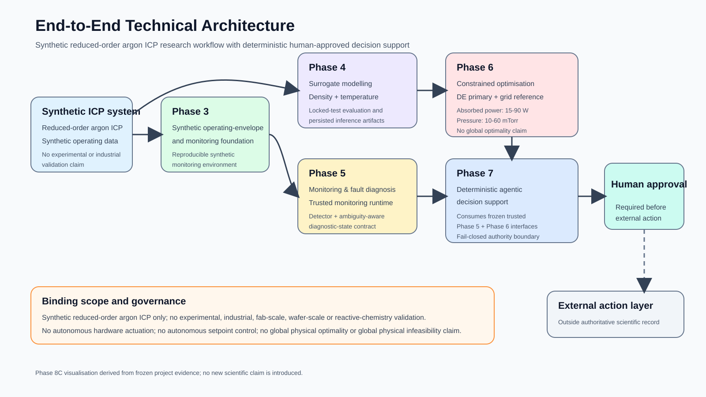
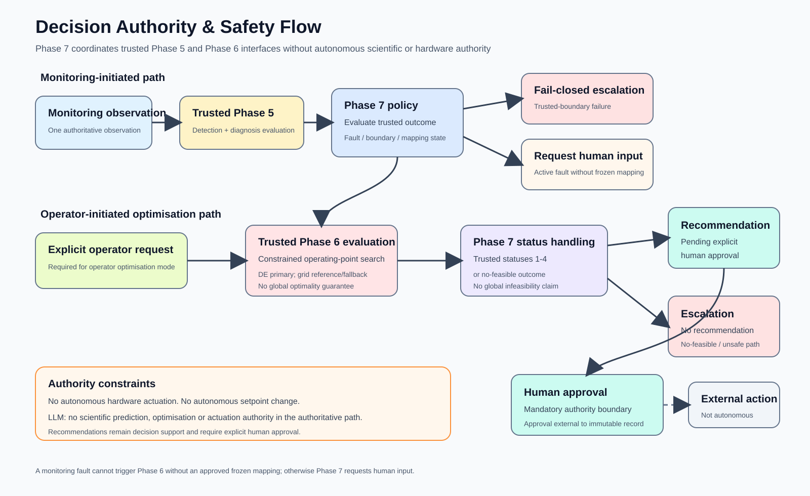
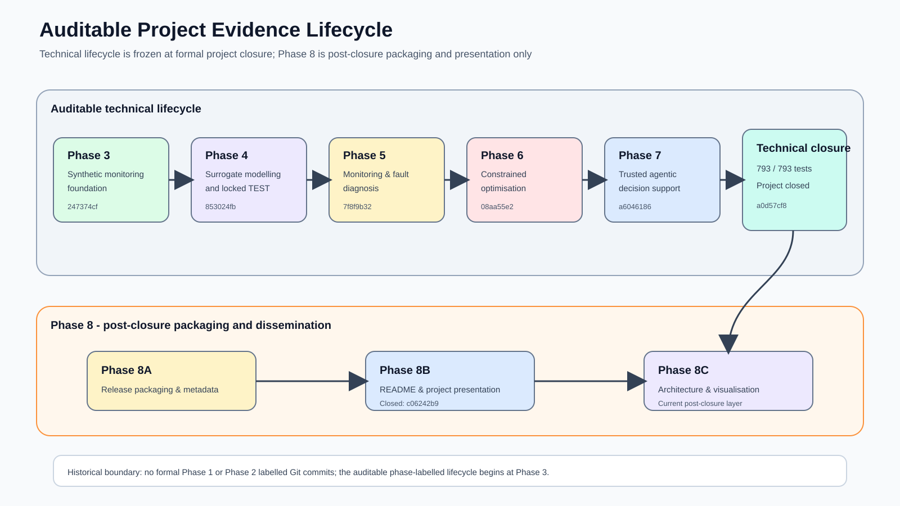

# Agentic AI for Reduced-Order ICP Plasma Process Monitoring, Fault Diagnosis and Constrained Operating-Point Optimisation

## Technical Project Report

Canonical post-closure technical report.

Package: `plasma-ai`
Version: `0.1.0`
Final technical qualification: **793 / 793 tests passed**
Immutable technical closure: `a0d57cf8838e294412f97ac2d898ee5aafe968c2`

---

## Abstract

This project develops and qualifies a reproducible research-engineering workflow for synthetic reduced-order argon inductively coupled plasma process analysis. The completed system spans a synthetic monitoring environment, surrogate modelling, process monitoring, fault detection and ambiguity-aware diagnosis, constrained operating-point optimisation, and deterministic human-approved agentic decision support.

The project is deliberately bounded. It does not claim experimental plasma validation, industrial process validation, fab-scale or wafer-scale validation, reactive-chemistry validity, autonomous hardware control, autonomous setpoint changes, global physical optimality, or global physical infeasibility.

The final technical project was formally closed after 793 / 793 tests passed. Phase 8 is post-closure packaging and dissemination only and does not reopen the frozen scientific baseline.

## 1. Project objective and scope

The project objective was to construct an auditable pipeline that moves from a synthetic reduced-order plasma environment to monitored, constrained and human-governed operating-point decision support.

The auditable phase-labelled Git lifecycle represented in the repository begins at Phase 3:

1. Phase 3 - synthetic monitoring environment.
2. Phase 4 - surrogate modelling.
3. Phase 5 - process monitoring and fault diagnosis.
4. Phase 6 - constrained operating-point optimisation.
5. Phase 7 - deterministic agentic decision support.

No formal version-controlled Phase 1 or Phase 2 closure claim is made.

The system is a synthetic research-engineering study. It is not presented as an experimentally validated plasma-control deployment.

## 2. End-to-end architecture



The architecture separates scientific prediction, monitoring, optimisation and authority. The synthetic reduced-order argon ICP environment provides the operating and monitoring foundation. Phase 4 supplies persisted surrogate models. Phase 5 supplies trusted monitoring and diagnostic inference. Phase 6 supplies constrained operating-point optimisation. Phase 7 coordinates the frozen Phase 5 and Phase 6 interfaces through deterministic fail-closed rules.

Recommendations require explicit human approval before any external action. No autonomous hardware actuation or autonomous setpoint control is authorised.

## 3. Phase 3 - synthetic monitoring environment

Phase 3 established the reproducible synthetic operating-envelope and monitoring-data foundation consumed by later phases.

Its purpose was to establish deterministic synthetic evidence suitable for subsequent surrogate modelling, monitoring development and qualification. Later phases consume this frozen foundation rather than silently redefining the data-generation basis.

Formal Phase 3 closure commit: `247374cf93d4335c81ef47956941b6918ea6c5e3`.

## 4. Phase 4 - surrogate modelling

Phase 4 converted the reduced-order source behaviour into persisted surrogate models under controlled modelling protocols. Work included target transformations, reference baselines, classical surrogate benchmarking, validation-based model selection, physics-aware acceptance, locked TEST evaluation, persistence checks and inference benchmarking.

### 4.1 Locked TEST performance

For density, locked TEST R2 was approximately **0.998746**. Mean absolute relative error was approximately **0.01373**, median relative error approximately **0.01031**, 95th-percentile relative error approximately **0.03861**, and maximum relative error approximately **0.08484**.

For electron temperature, locked TEST R2 was approximately **0.999999994**. RMSE was approximately **1.06e-05 eV**, 95th-percentile absolute error approximately **2.22e-05 eV**, and maximum absolute error approximately **1.06e-04 eV**.

A final 41 x 41 diagnostic grid comprising **1,681 points** passed the Phase 4 diagnostic acceptance checks.

These results describe withheld synthetic same-study data. They do not constitute experimental or industrial validation.

### 4.2 Inference benchmark

The benchmark used a 64-point workload. The recorded source-model median was approximately **209.41 ms per point**. Surrogate scalar inference was approximately **71.12 ms per point**, corresponding to about **2.94x** speedup. Batched surrogate inference was approximately **1.40 ms per point**, corresponding to about **149.30x** speedup.

These timings are implementation-, workload-, hardware- and software-dependent benchmark evidence rather than a universal throughput guarantee.

Formal Phase 4 closure commit: `853024fbc76f3fc046cab018bf57002bba80263c`.

## 5. Phase 5 - process monitoring and fault diagnosis

Phase 5 established leakage-safe monitoring, anomaly detection, supervised fault detection and ambiguity-aware diagnosis over the frozen synthetic monitoring environment.

The trusted monitoring runtime transforms six approved raw channels into nine runtime features. The frozen detector threshold is exactly **0.40**. Diagnostic inference occurs only for detector-positive rows.

The final ambiguity-aware states are `none`, `flow_delivery`, `power_coupling`, and `pressure_path_anomaly`.

### 5.1 Detector evidence

Locked detector evidence included balanced accuracy approximately **0.79988**, macro F1 approximately **0.80381**, active-fault recall approximately **0.67819**, positive precision approximately **0.87709**, specificity approximately **0.92157**, false-positive rate approximately **0.07843**, AUROC approximately **0.83131**, and average precision approximately **0.86825**.

Active-fault recall remained below the frozen 0.75 target. The locked result was preserved rather than retuned after evaluation.

At episode level, all 12 synthetic fault episodes were eventually detected. Detection delay, measured in `step_index` rather than physical time, had mean approximately **6.42**, median **4.5**, and maximum **18**.

Six fault episodes exhibited pre-active false alarms, while all four normal TEST episodes contained at least one false alarm. These limitations remain part of the frozen evidence.

### 5.2 Diagnosis evidence

The frozen diagnoser achieved macro F1 approximately **0.73632**, balanced accuracy approximately **0.75319**, and minimum class recall approximately **0.66667**.

End-to-end detector-plus-diagnoser evaluation achieved macro F1 approximately **0.68098** and balanced accuracy approximately **0.66831**.

Class recall was approximately 0.92157 for `none`, 0.70085 for `flow_delivery`, 0.63107 for `power_coupling`, and 0.41975 for `pressure_path_anomaly`. The pressure-path route is therefore explicitly the weakest final class.

Persistence equivalence was verified using 45 deterministic probe rows with zero observed detector-probability difference.

Formal Phase 5 closure commit: `7f8f9b32c8551f422283d996cd358e729146181a`.

## 6. Phase 6 - constrained operating-point optimisation

Phase 6 established deterministic constrained optimisation over the frozen surrogate domain.

The frozen operating domain is:

- absorbed power from **15 W to 90 W inclusive**;
- pressure from **10 mTorr to 60 mTorr inclusive**.

Absorbed power is not asserted to be identical to generator RF power.

### 6.1 Search protocol

The mandatory deterministic reference grid contains **151 x 101 = 15,251 operating points**.

Differential Evolution was selected as the primary continuous optimiser. SHGO was retained as a comparator. The deterministic grid remains the mandatory reference and the defined fallback mechanism.

Ten qualification scenarios were used.

A no-feasible result means only that no feasible point was found under the frozen search protocol. It is not evidence of global physical infeasibility.

Accepted optimiser output does not establish global continuous or global physical optimality.

The Phase 6 pre-closure regression suite reached **621 / 621 tests passed** and the formal Phase 6 closure checklist contained **75 completed items**.

Formal Phase 6 closure commit: `08aa55e22b5c8d8cf7c397797481d6e94651dbc5`.

## 7. Phase 7 - deterministic agentic decision support

Phase 7 integrates the frozen Phase 5 monitoring runtime and Phase 6 optimisation runtime through deterministic orchestration.



Phase 7 is deterministic decision support, not autonomous control.

A monitoring trusted-boundary failure causes fail-closed escalation. An active fault without a frozen fault-to-optimisation mapping produces a request for human input rather than an invented optimisation request.

Operator-initiated optimisation requires an explicit operator request. Trusted Phase 6 statuses 1 through 4 may produce a recommendation pending explicit human approval. A no-feasible outcome causes escalation without a recommendation.

A single decision unit is bounded to at most one authoritative monitoring observation, one trusted Phase 5 evaluation, one Phase 6 request, one trusted Phase 6 evaluation and one human-approval target.

Approval events remain external to the immutable scientific decision record.

The authoritative path gives LLMs no authoritative scientific or actuation authority.

Phase 7 qualification included 20 recording tests, 35 policy tests and 31 orchestrator tests. The agentic regression suite reached **172 tests passed**.

Formal Phase 7 closure commit: `a6046186edf33985475cce7dc665e537f9132965`.

## 8. Auditable lifecycle and closure



The principal formal closure lineage is:

- Phase 3: `247374cf93d4335c81ef47956941b6918ea6c5e3`;
- Phase 4: `853024fbc76f3fc046cab018bf57002bba80263c`;
- Phase 5: `7f8f9b32c8551f422283d996cd358e729146181a`;
- Phase 6: `08aa55e22b5c8d8cf7c397797481d6e94651dbc5`;
- Phase 7: `a6046186edf33985475cce7dc665e537f9132965`;
- whole technical project: `a0d57cf8838e294412f97ac2d898ee5aafe968c2`.

The whole technical project closed with **793 / 793 tests passed**.

Phase 8 occurs strictly after technical closure and is limited to release packaging, presentation, visualisation, reporting and professional dissemination.

## 9. Reproducibility and software engineering

The project is packaged as `plasma-ai`, version `0.1.0`, requiring Python 3.11 or later.

Core declared dependencies include NumPy, SciPy and scikit-learn, with pytest in the development dependency set.

Git provides the auditable evidence backbone. Large Phase 4 model artifacts are tracked through Git LFS.

The documented reproducibility path is:

```text
git lfs install
git clone https://github.com/ashasif/agentic-ai-plasma-optimisation.git
cd agentic-ai-plasma-optimisation
python -m venv .venv
python -m pip install -e ".[dev]"
python -m pytest -q
```

The frozen final technical qualification is 793 / 793 tests passed. Phase 8 documentation changes do not redefine that result.

## 10. Scientific interpretation

The strongest evidence is internal reproducibility over a frozen synthetic reduced-order study.

Surrogate performance is very strong on the locked synthetic TEST data, while the monitoring subsystem exposes materially weaker behaviour, particularly active-fault recall, false alarms and pressure-path diagnosis.

The project preserves these weaker outcomes rather than obscuring them behind the stronger surrogate results.

The optimisation layer likewise treats its outputs as protocol-bounded computational results rather than proof of universal physical optimality.

## 11. Safety, governance and human authority

The authority model is deliberately conservative:

- scientific inference is delegated only to frozen trusted runtime components;
- trusted-boundary failures fail closed;
- missing fault-to-optimisation mappings are not invented;
- operator optimisation remains explicitly operator initiated;
- recommendations require explicit human approval;
- no autonomous hardware actuation is authorised;
- no autonomous setpoint change is authorised;
- LLMs have no authoritative scientific or actuation authority.

These rules are part of the architecture rather than merely external disclaimers.

## 12. Limitations

1. **Synthetic environment.** No experimental plasma system was used for validation.
2. **Reduced-order physics.** The source environment is a reduced-order argon ICP representation.
3. **No reactive-chemistry validation.** Etch, deposition and reactive-species behaviour remain outside the validated scope.
4. **No semiconductor-production validation.** No fab-scale or wafer-scale claim is made.
5. **Monitoring limitations.** Active-fault recall and false-alarm behaviour remain imperfect, and pressure-path diagnosis is the weakest final class.
6. **Optimisation boundaries.** Search results apply only under the frozen surrogate, constraints, domain and search protocol.
7. **No global physical guarantee.** Neither global physical optimality nor global physical infeasibility is established.
8. **No autonomous control.** Phase 7 provides deterministic decision support only.

## 13. Future research directions

Future scientific work could introduce experimental plasma measurements, richer sensors, improved pressure-path identifiability, uncertainty-aware surrogate models, reactive-chemistry extensions, hardware-in-the-loop qualification and formally governed interfaces to physical control systems.

Such work would constitute new scientific development and is outside the immutable closed technical baseline.

## 14. Conclusion

The project demonstrates an end-to-end auditable workflow for synthetic reduced-order ICP plasma monitoring, surrogate modelling, fault diagnosis, constrained optimisation and deterministic human-approved decision support.

Its contribution is not a claim of autonomous plasma control. It is the integration of frozen scientific evidence, explicit limitations, deterministic optimisation protocols, persisted runtimes, fail-closed authority boundaries and mandatory human approval within one version-controlled research-engineering system.

The technical project formally closed with **793 / 793 tests passed** at commit `a0d57cf8838e294412f97ac2d898ee5aafe968c2`.

## 15. Authoritative project evidence

This report is derived from frozen repository documentation:

- [`project_final_summary.md`](../project_final_summary.md)
- [`project_closure_checklist.md`](../project_closure_checklist.md)
- [`Phase 3 README`](../phase3/README.md)
- [`Phase 4H summary`](../phase4/phase4h_summary.md)
- [`Phase 5H summary`](../phase5/phase5h_summary.md)
- [`Phase 6G summary`](../phase6/phase6g_summary.md)
- [`Phase 7 summary`](../phase7/phase7_summary.md)
- [`Phase 8B summary`](phase8b_summary.md)
- [`Phase 8C summary`](phase8c_summary.md)

This report introduces no new experiment, model fit, optimisation run, monitoring evaluation or scientific conclusion.
